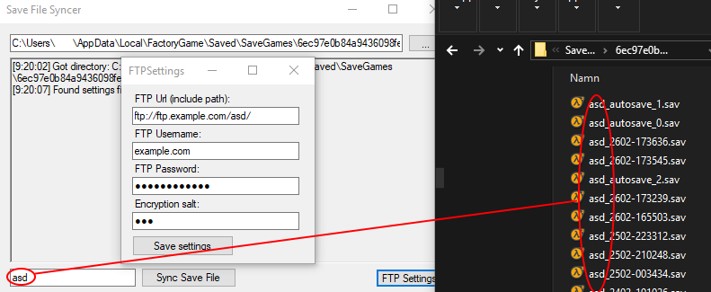

# Satisfactory save file synchronizer
Synchronize your save file between others in the game Satisfactory

## What does it do?

This helps you share your save file (server) with your friends, all of you need a copy of the program and some very basic tech skills. It compares the latest save file (with a specified server name) on your machine to a FTP uploaded save file and decides to upload or download. It doesn't delete the older save files so make sure you have at least ~100MB storage on your host. This is so you can later download the older save files and see the changes.
### Prerequisites

If you what to compile it on your own you will need a .net compiler. Otherwise the following are the only requirements.

```
One FTP server with an empty folder you are willing to enter the password in this program to. (You can use a free host, let me know if you need help).
.NET Framework v4.5 or greater
```

### Installing

You can either compile the repository for the latest version or download an executable from the [release](https://github.com/jztmanyl/SatisfactorySaveFileSyncer/releases/) page.

## Running the program

You will need to enter your FTP settings by pressing FTP settings and also choosing an encryption hash. This will create a file called "savefilesync.dat" containing all the details in the same directory as the exe. Remember to also share this file with your friends.

In the main form you will need to make sure the right directory is selected and that the server name is correct.

This is how it can look like




## Built With

* [Visual Studio](https://visualstudio.microsoft.com/) - The IDE used

## Contributing

Please be free to contribute and by contacting me on discord: manyl#1663.

## Authors

* **Max Nylander** - *Initial work* - [jztmanyl](https://github.com/jztmanyl)

See also the list of [contributors](https://github.com/jztmanyl/SatisfactorySaveFileSyncer/contributors) who participated in this project.

## License

This project is licensed under the GPL-3.0 License - see the [LICENSE.md](LICENSE.md) file for details

## Acknowledgments

* Security risk considering you're sharing your password with basic encryption
* May contain bugs since it's only been used by people thoroughly instructed on usage
* newtonsoft (and others) for Newtonsoft.JSON
* chetanvajre2012 for RijndaelEncryptDecrypt
* Fody for Costura
